# pkHouse

A local bank system for Pokemon games on Nintendo Switch. Move Pokemon between your save files and local bank storage.

## Disclaimer

This software is provided "as-is" without any warranty.\
While the app has been tested, it may contain bugs that could corrupt or damage your save files.

**Use at your own risk.**

The author is not responsible for any data loss or damage to your save data.

This is why the automatic backup system exists — always verify your backups before making changes.

If you need to restore a backup, use a save manager such as [Checkpoint](https://github.com/FlagBrew/Checkpoint) or [JKSV](https://github.com/J-D-K/JKSV) to import the backup files back onto your Switch.


## Supported Games

| Game | Tested Version | Save Format | Boxes | Slots/Box |
|------|----------------|-------------|-------|-----------|
| Pokemon Let's Go Pikachu | 1.0.2 | BEEF blocks (`savedata.bin`) | 40 | 25 |
| Pokemon Let's Go Eevee | 1.0.2 | BEEF blocks (`savedata.bin`) | 40 | 25 |
| Pokemon Sword | 1.3.2 | SCBlock (`main`) | 32 | 30 |
| Pokemon Shield | 1.3.2 | SCBlock (`main`) | 32 | 30 |
| Pokemon Brilliant Diamond | 1.3.0 | Flat binary (`SaveData.bin`) | 40 | 30 |
| Pokemon Shining Pearl | 1.3.0 | Flat binary (`SaveData.bin`) | 40 | 30 |
| Pokemon Legends: Arceus | 1.1.1 | SCBlock (`main`) | 32 | 30 |
| Pokemon Scarlet | 4.0.0 | SCBlock (`main`) | 32 | 30 |
| Pokemon Violet | 4.0.0 | SCBlock (`main`) | 32 | 30 |
| Pokemon Legends: Z-A | 2.0.1 | SCBlock (`main`) | 32 | 30 |

> **Note:** Moving Pokemon between different games is not supported. Banks are separated by game family because transferred Pokemon would lack the HOME Tracker ID required for cross-game compatibility.

## Features

### Profile Selection

On Switch, pkHouse loads all user profiles from the system.\
Select your profile, then choose a game.\
The app detects which games have save data for the selected profile.\
Your profile name is shown alongside the game name in all views.

### Two-Panel Box Viewer

In **title override mode**, the main view displays your **game save** on the left and your **bank** on the right, side by side.\
In **applet mode** (bank-only), both panels show **banks**, allowing bank-to-bank transfers.\
Navigate freely between both panels to move Pokemon back and forth.

### Pick & Place

Press **A** on a Pokemon to pick it up, navigate to any slot (in either panel), and press **A** again to place it.\
Placing on an occupied slot swaps the two Pokemon.\
Press **B** to cancel and return the Pokemon to its original slot.\
Press **X** while holding Pokemon to delete them (with confirmation). Useful for clearing boxes of rejected eggs.

### Multi-Select

There are three ways to select Pokemon:

- **Tap Y** on individual Pokemon to toggle selection one by one.
- **Hold Y + D-Pad** to draw a rectangular selection across multiple slots at once.
- **Double-tap Y** to select all Pokemon in the current box (shown in green).

Only occupied slots are selected. Selected slots display a numbered badge showing the pick-up order.

Press **A** to pick up all selected Pokemon, then navigate to another box and press **A** to place them.\
Regular selections (cyan) place Pokemon into the first available empty slots.\
"Select all" selections (green) preserve original positions — each Pokemon is placed at the same slot index in the target box. All matching slots must be empty.\
Press **B** to cancel and return all Pokemon to their original positions.

Selection is cleared when switching boxes or panels.

### Box View

Press **ZL** to open a box overview of all save boxes, or **ZR** for all bank boxes.\
Navigate the grid with the D-Pad. A semi-transparent preview of the highlighted box's contents (Pokemon sprites) appears as you move.\
Press **A** to jump directly to that box, or **B** to cancel.

### Pokemon Details

Press **X** on any Pokemon to view detailed information:

- Species, level, gender
- National Pokedex number
- Original Trainer (OT) and Trainer ID
- Nature and Ability
- All 4 moves
- IVs (perfect 31s highlighted in gold)
- EVs

Shiny Pokemon names are displayed in gold. Alpha Pokemon (Legends: Arceus / Z-A) show a dedicated icon.

### Bank System

Banks are local `.bin` files stored per game family. Paired games share the same bank folder, so you can move Pokemon between versions (e.g. Sword and Shield).

| Game Family | Bank Folder |
|-------------|-------------|
| Let's Go Pikachu / Eevee | `banks/LetsGo/` |
| Sword / Shield | `banks/SwordShield/` |
| Brilliant Diamond / Shining Pearl | `banks/BDSP/` |
| Legends: Arceus | `banks/LegendsArceus/` |
| Scarlet / Violet | `banks/ScarletViolet/` |
| Legends: Z-A | `banks/LegendsZA/` |

From the bank selector you can:

- **Create** a new bank (up to 32-character name). On Switch, available SD card space is checked before creating — if there isn't enough room, an error is shown.
- **Rename** an existing bank
- **Delete** a bank (with confirmation)

Each bank has the same box capacity as its game family (32 or 40 boxes).\
The bank list shows the number of occupied slots for each bank.

You can switch between banks from the main view via the menu. Both the save and bank are saved together before switching to prevent data inconsistency.\
If no other bank is available when switching, the app offers to create a new one directly.\
You cannot delete a bank that is currently loaded.

### Backup System

When loading a game save on Switch, an automatic backup is created before any modifications:

```
backups/<profile>/<game>/<profile>_YYYY-MM-DD_HH-MM-SS/
```

This is a full copy of the mounted save directory.\
The backup is only created once when initially selecting a game — switching banks does not trigger additional backups.

Before backing up, the app checks available SD card space. If there isn't enough free space (2x the save size), a warning is shown with the option to continue without a backup or cancel. If the backup itself fails, you'll see a similar prompt before proceeding.

### Themes

pkHouse includes 7 color themes:

| Theme | Style |
|-------|-------|
| Default | Dark blue-gray (original) |
| HOME | Light pastels inspired by Pokemon HOME |
| HOME - Violet | Purple/lavender tones from HOME's Pokedex |
| HOME - Blue | Blue palette from HOME's GTS |
| HOME - Green | Green variant of the HOME style |
| HOME - Red | Red variant of the HOME style |
| Pikachu | Yellow and brown Pikachu colors |

Change themes from the **menu** (+ button) in the main view, or press **Y** on the profile/game selection screens.\
A live preview is applied as you scroll through the list. Press **A** to confirm or **B** to cancel and revert.\
Your theme choice is saved automatically and persists across sessions.

### Search / Filter

Search for Pokemon across both panels (save and bank) using the **menu** (+ button → Search).

Available filters:

| Filter | Description |
|--------|-------------|
| Species Name | Text search (substring, case-insensitive) |
| OT Name | Text search (substring, case-insensitive) |
| Shiny | Toggle to match shiny Pokemon only |
| Egg | Toggle to match eggs only |
| Alpha | Toggle to match alpha Pokemon only (Legends: Arceus / Z-A only) |
| Gender | Cycle: Any / Male / Female / Genderless |
| Level | Min and max level range |
| Perfect IVs | Off / 1+ (at least one 31 IV) / 6IV (all 31) |

Results are shown as a scrollable list with status badges ([S] shiny, [A] alpha, [E] egg), species name, level, gender, and location.\
Press **A** to jump directly to a result in the box view, **L/R** to skip 10 results, **X** to go back and adjust filters, or **B** to close.

### Save Integrity

- **SCBlock saves** (ZA, SV, SwSh, PLA): Decrypted, modified, and re-encrypted. A round-trip verification runs on load to confirm the cycle is lossless.
- **BDSP saves**: Flat binary with MD5 checksum, recalculated on every save.
- **LGPE saves**: BEEF block format with CRC16 checksums, recalculated on every save. Storage is compacted before writing.
- All saves are written in-place to preserve the Switch filesystem journal.

## Controls

### Profile Selector

| Button | Action |
|--------|--------|
| D-Pad Left/Right | Navigate profiles |
| A | Select profile |
| Y | Theme selector |
| - | About |
| + | Quit |

### Game Selector

| Button | Action |
|--------|--------|
| D-Pad | Navigate game grid |
| A | Select game |
| B | Back to profile selector |
| Y | Theme selector |
| - | About |
| + | Quit |

### Bank Selector

| Button | Action |
|--------|--------|
| D-Pad Up/Down | Navigate bank list |
| A | Open bank |
| Y | Create new bank |
| X | Rename bank |
| + | Delete bank |
| B | Back (main view if bank loaded, otherwise game selector) |
| - | About |

When switching banks, the selector appears on the side being switched while the other panel remains visible.

### Main View

| Button | Action |
|--------|--------|
| D-Pad | Move cursor |
| L / R | Switch box |
| ZL / ZR | Box view (save / bank) |
| A | Pick up / Place Pokemon |
| B | Cancel / Return held Pokemon |
| Y | Toggle multi-select |
| X | View Pokemon details / Delete held Pokemon |
| + | Open menu |
| - | About |

### Menu Options (Title Override Mode)

| Option | Description |
|--------|-------------|
| Theme | Open the theme selector |
| Search | Search for Pokemon across both panels |
| Switch Bank | Save game and bank, return to bank selector |
| Change Game | Save everything, return to game selector |
| Save & Quit | Save everything and exit |
| Quit Without Saving | Exit without saving changes |

### Menu Options (Applet / Bank-Only Mode)

| Option | Description |
|--------|-------------|
| Theme | Open the theme selector |
| Search | Search for Pokemon across both panels |
| Switch Left Bank | Save both banks, switch the left bank |
| Switch Right Bank | Save both banks, switch the right bank |
| Change Game | Save both banks, return to game selector |
| Save Banks | Save both banks |
| Quit | Exit |

## Building

### Prerequisites

- [devkitPro](https://devkitpro.org/) with the devkitA64 toolchain
- Switch portlibs: SDL2, SDL2_image, SDL2_ttf

```bash
dkp-pacman -S switch-sdl2 switch-sdl2_image switch-sdl2_ttf switch-freetype switch-harfbuzz
```

### Build

```bash
export DEVKITPRO=/opt/devkitpro
make all
```

Produces `pkHouse.nro`.

```bash
make clean
```

### Running

Place `pkHouse.nro` on your Switch SD card (`sdmc:/switch/pkHouse/`) and launch via a homebrew launcher.

- **Title override mode**: Full access — game save on the left, bank on the right. Requires launching through a game title.
- **Applet mode** (album/homebrew menu): Bank-only access — two banks side by side for bank-to-bank transfers. Save data is not accessible in this mode. Use title override mode to transfer Pokemon between your save and a bank.

## Screenshots

<div align="center">
    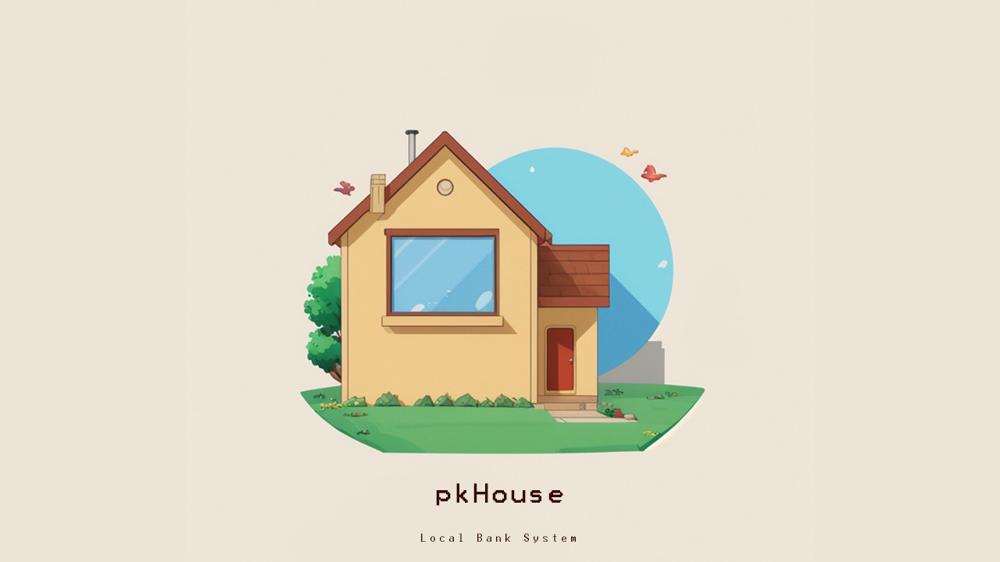
    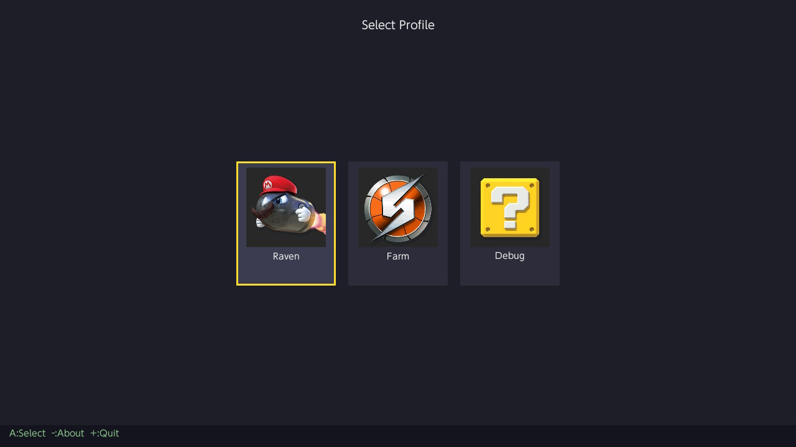
    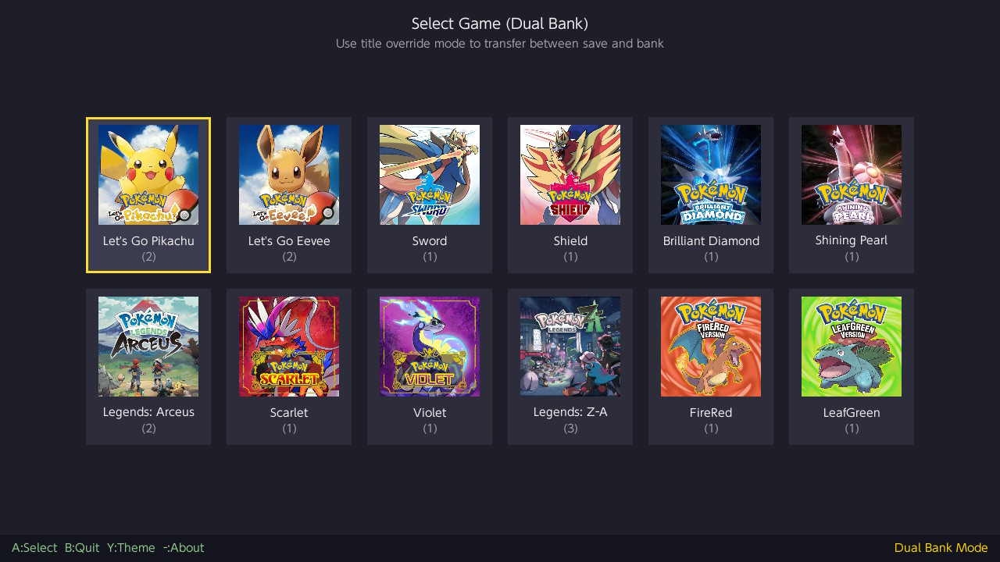
    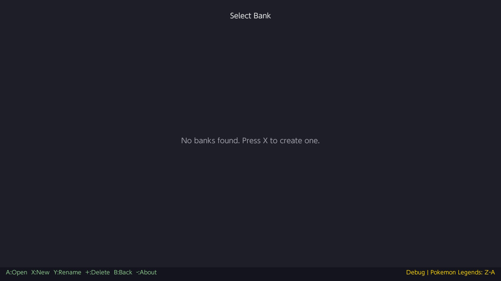
    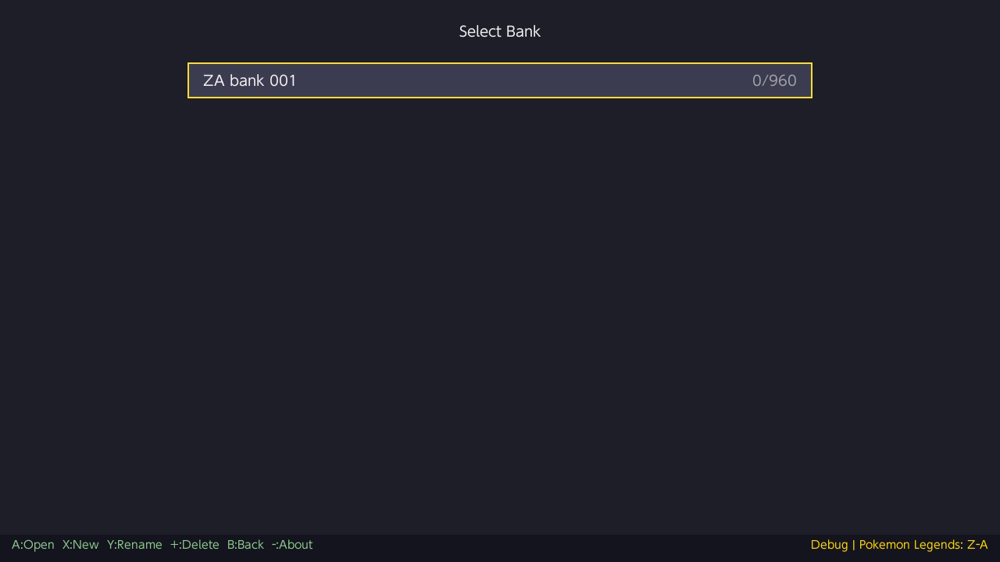
    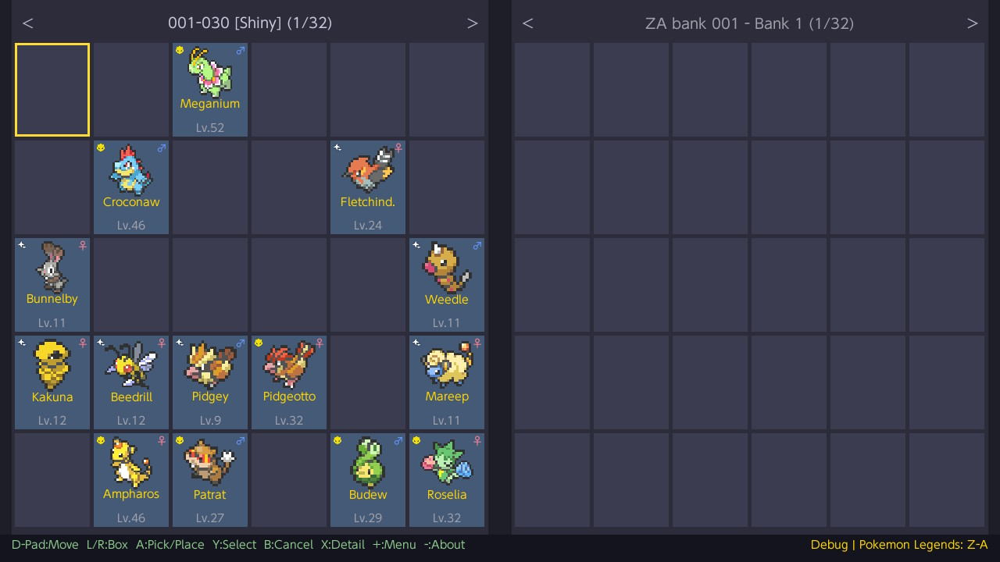
    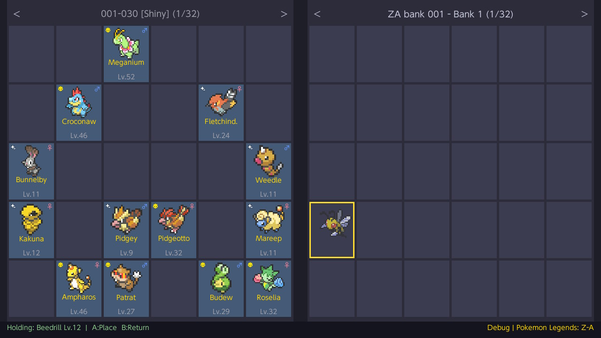
    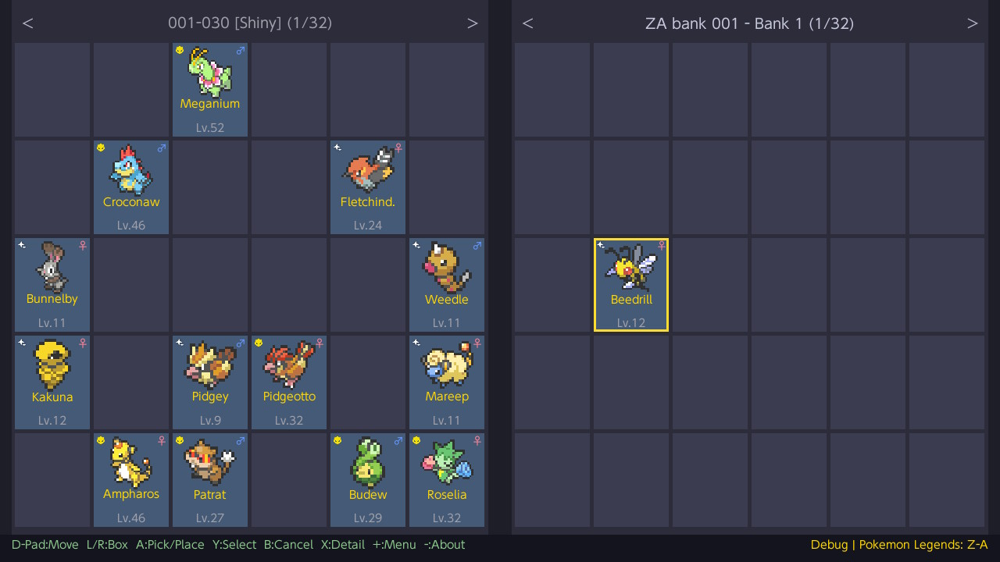
    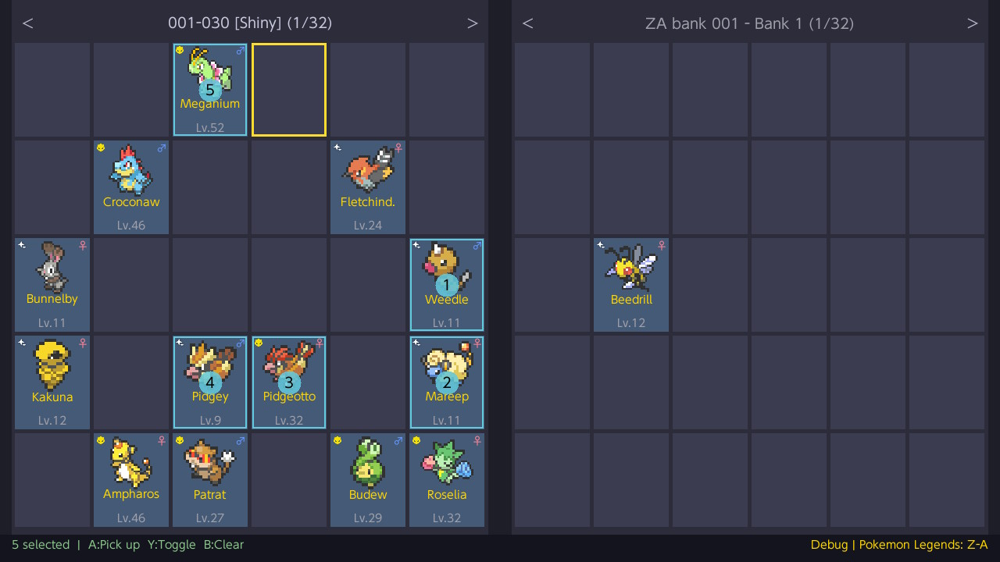
    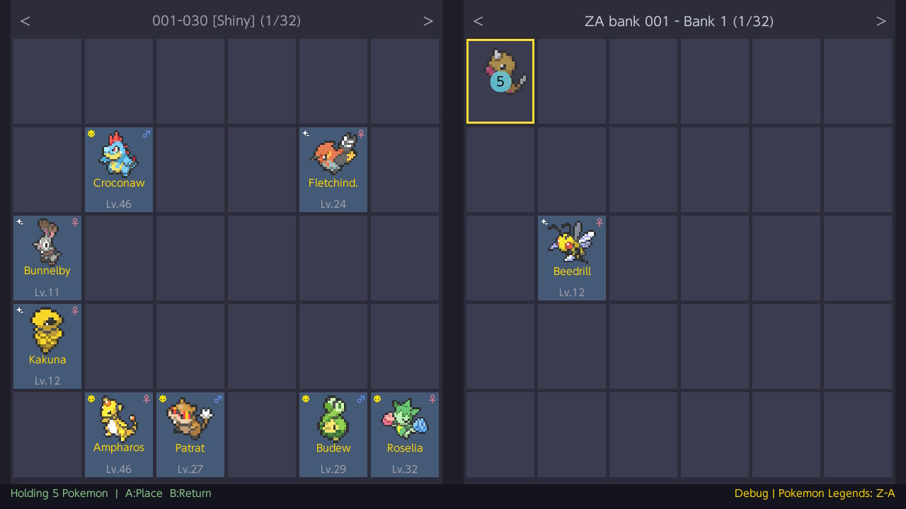
    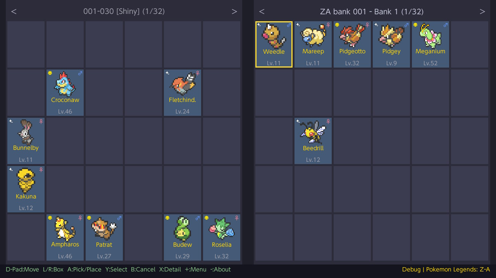
    
    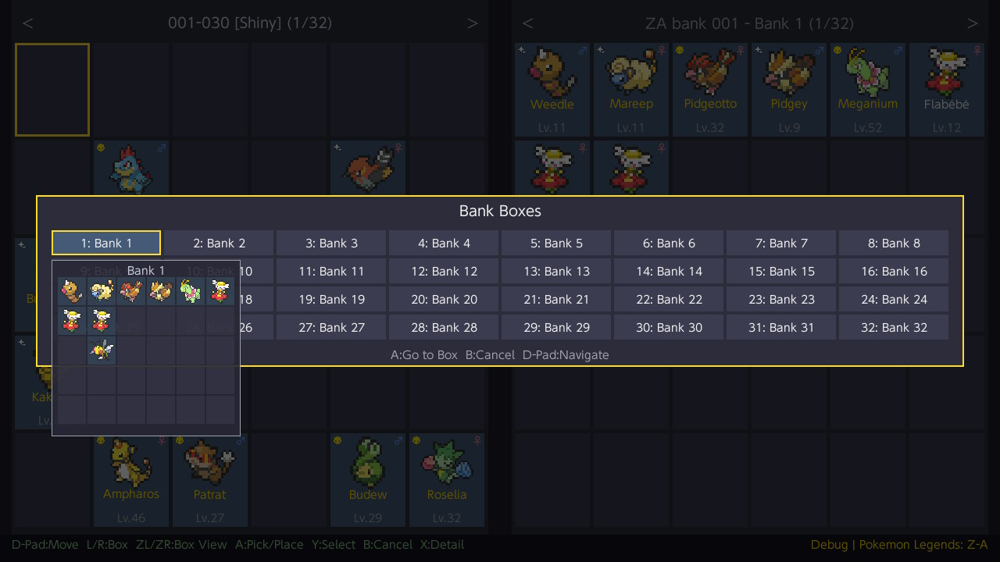
    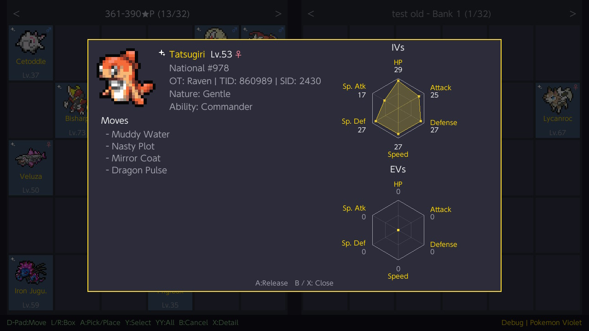
    
    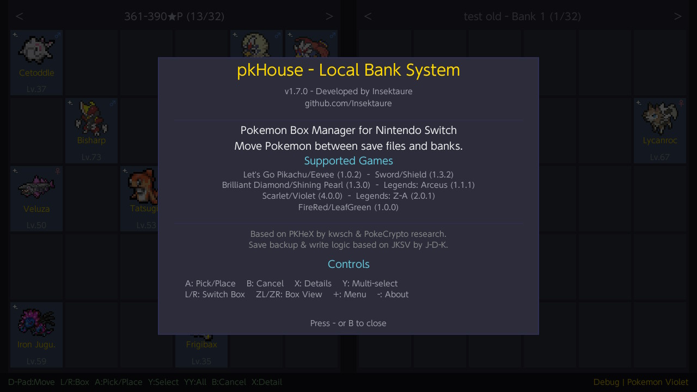
</div>

## Credits

- [PKHeX](https://github.com/kwsch/PKHeX) by kwsch — PokeCrypto research and save structure reference
- [JKSV](https://github.com/J-D-K/JKSV) by J-D-K — Save backup and write logic reference
- Built with [libnx](https://github.com/switchbrew/libnx) and [SDL2](https://www.libsdl.org/)
